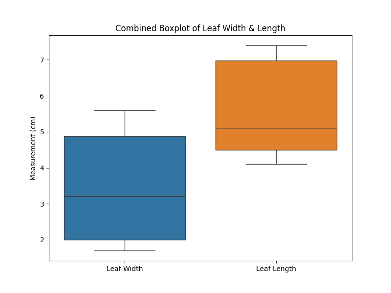

# HW2
DS5110  
Homework 2 - Data Collection  
Due 1/24/2025

1.I selected three plant species around my area: Maple, Rose, and Cactus. For each species, I collected 10 samples of leaves. Using a ruler, I measured the leaf width and length for each leaf. The measurements were recorded in a notebook and later input into a CSV file for analysis.

2.I used a standard 15 cm ruler with millimeter markings to measure the width and length of the leaves. It was suitable for the relatively small dimensions of the leaves.

3. The ruler provides accuracy up to 1 millimeter, which is sufficient for leaf measurements. However, slight manual errors in aligning the ruler with irregular leaf edges might reduce precision slightly. Despite this, the instrument is reliable for general data collection purposes in this context.

4. I collected 30 data points in total, 10 for each plant species. This sample size was chosen to provide a balance between capturing variation in leaf size and the practical constraints of time and resources.

5. What can you infer from the data and graphs?

Leaf Width vs. Length: The scatter plot shows that Maple leaves tend to be larger in both width and length, while Cactus leaves are smaller and more consistent.

Histograms: The distribution of leaf lengths shows that Maple has the highest variation, whereas Rose and Cactus have more clustered values.

Boxplots: The boxplot highlights outliers, especially for Maple, where some leaves are significantly larger than the median.

Statistical Findings: The mean and variance indicate that Maple leaves are more varied, while Cactus leaves have a tighter range.

6. Some challenges included identifying plant species accurately and dealing with irregularly shaped leaves, which made precise measurements more difficult. Environmental factors, such as wind, also affected measurement stability, and handling delicate leaves without damage required extra care.

# HW2 - Data Collection and Analysis

## 1. Histograms of Leaf Length for Each Plant

## 2. Histograms of Leaf Width for Each Plant

## 3. Combined Histogram of Leaf Width & Length

## 4. Boxplots of Leaf Measurements by Plant Type

## 5. Combined Boxplot of Leaf Width & Length

## 6. Scatter Plot of Leaf Dimensions

## 7. Summary Statistics
